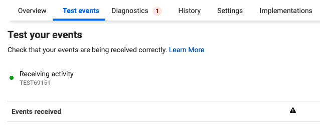

## Main features

### FacebookExecutor

Python utility to perform task against the Facebook API

#### Example

```python
from pygyver.etl.facebook import FacebookExecutor

# Login
fb = FacebookExecutor()

# Get Active Campaign budget for the Facebook account 12346789
account_id = '12346789'
active_campaigns = fb.get_active_campaign_budgets(
    account_id
)
```

### Conversions API

There are two functions to push Facebook Events to the Conversions API:
- push_conversions_api_events
- push_conversions_api_batch

The first function pushes a list of Facebook Events to the Conversions API. The latter function breaks up a DataFrame with a large number of events into batches returning a list of DataFrames. As of November 2020, the Facebook API will only accept 1,000 events per batch. Any larger batches will be dropped [Facebook API Docs](https://developers.facebook.com/docs/marketing-api/conversions-api/using-the-api#batch-requests).

When testing the Facebook Conversions API, ensure you've set up the following environment variables:
- FACEBOOK_APPLICATION_CREDENTIALS -> token path
- GOOGLE_APPLICATION_CREDENTIALS -> token path
- BIGQUERY_PROJECT -> dev environment

You will also need to update the `test_event_code` value in the test case with the current value in Facebook Events Manager as this changes every day. In the below screenshot, the test_event_code is TEST69151.


Facebook accepts events with a specific data structure. The `build_predicted_revenue_events` converts a DataFrame into the expected Facebook data struture which can be pushed to the Conversions API.

####Example
```python
from pygyver.etl.facebook import FacebookExecutor
from pygyver.etl.facebook import build_predicted_revenue_events
from pygyver.etl.dw import BigQueryExecutor
from pygyver.etl.dw import read_sql

# Login to Facebook and Google BQ
db = BigQueryExecutor()
fbe = FacebookExecutor()

# Set the Pixel ID to push events to
fbe.set_pixel_id('1530331220624093')

# Read BigQuery data to push events for
sql = read_sql(
        file='tests/sql/unit_predicted_revenue_mocked.sql'
    )

df1 = db.execute_sql(
    sql=sql,
    project_id='madecom-dev-jean-maldonado'
)

events, logs = build_predicted_revenue_events

# Push events in batches of size 2 using the build_predicted_revenue_events event builder function
result = fbe.push_conversions_api_events(events, 'TEST69151')
```